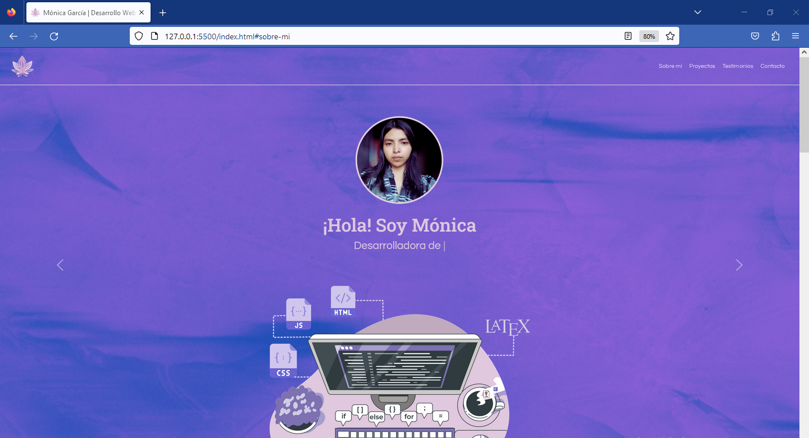
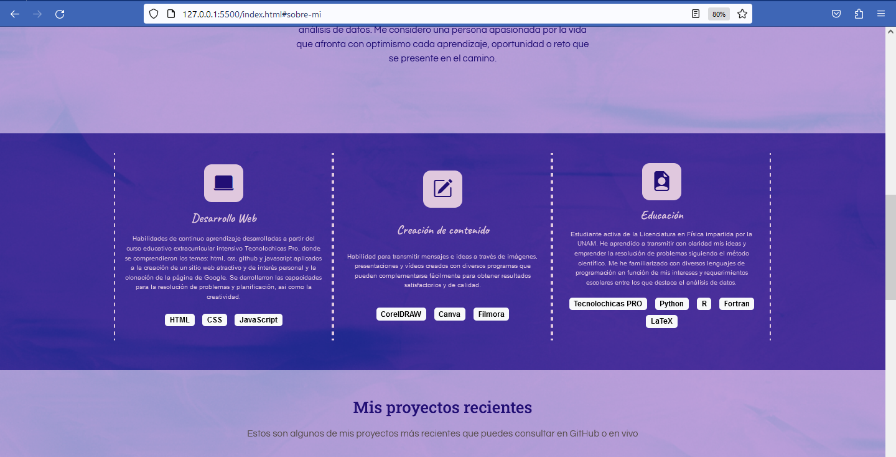
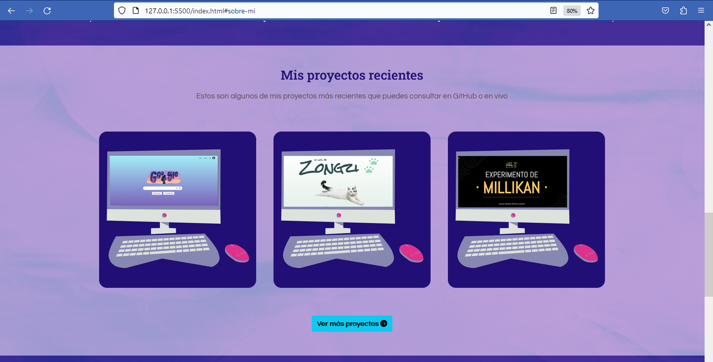
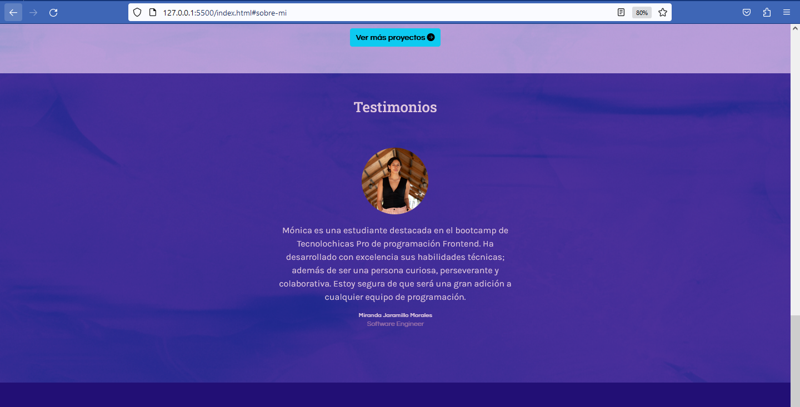

# Portafolio Adaptable (Responsive) con Bootstrap 5

Este es el proyecto final para el bootcamp Tecnolochicas PRO a partir de la adaptación a una plantilla dada. Esta página web adaptable a dispositivos de distintos tamaños (este tipo de sitio web se conoce en inglés como "responsive"). 

El propósito de esta página web es mostrar el portafolio de proyectos de un(a) desarrollador(a) y su experiencia. Incluye una descripción breve de su motivación, experiencia, proyectos y formas de contacto. 

### Capturas de pantalla:

Primera parte de la página web:

Experiencia:

Proyectos:

Testimonios:

Contacto:

## Tecnologías

Esta página web fue creada con:

* HTML
* CSS
* JavaScript 
* Bootstrap 5

Además, se incluyeron **Google Fonts** para personalizar la fuente y **Bootstrap icons** para incorporar íconos como flechas y logos de redes sociales populares. 

## Recursos

Los iconos e imágenes utilizados que no pertenecían a Bootstrap son los siguientes:

[Code typing concept illustration](https://www.freepik.com/free-vector/code-typing-concept-illustration_10259340.htm#query=web%20hands%20coding%20illustration&position=3&from_view=search&track=robertav1_2_sidr) 

[File extension icons created by iconixar](https://www.flaticon.com/free-icons/file-extension) 

[Coding icons created by iconixar](https://www.flaticon.com/free-icons/coding)

[R icons created by Becris](https://www.flaticon.com/free-icons/r) 

[python file icons](https://www.flaticon.com/free-icons/python-file) 

[Monochromatic tropical leaves, Freepik ](https://www.freepik.com/free-vector/monochromatic-tropical-leaves-pack_7966141.htm#query=leaf%20purple%20illustration&position=35&from_view=search&track=robertav1_2_sidr) 

## Español

El texto de la página web está escrito en español, al igual que las clases y atributos personalizados. Las clases relacionadas con Bootstrap se incluyeron en inglés.

